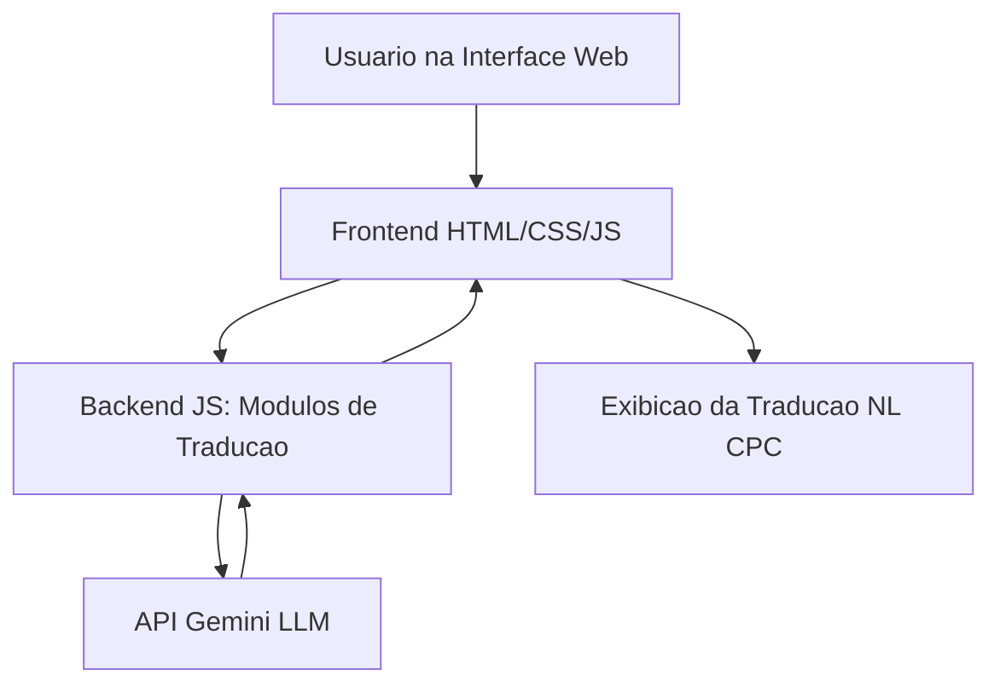

#  Veridictum — Agente NL ↔ CPC

> Tradutor inteligente entre **Linguagem Natural (NL)** e **Cálculo Proposicional Clássico (CPC)**.

---

## Descrição Geral

**Veridictum.AI** é um agente web que traduz automaticamente frases em português para expressões lógicas proposicionais — e vice-versa.  
O objetivo é auxiliar estudantes no aprendizado de **Lógica Proposicional**, combinando **regras determinísticas** com **modelos de linguagem (LLMs)** via **API Gemini**.

---

## Arquitetura do Sistema



### Componentes

| Camada | Descrição |
|--------|------------|
| **Frontend (Web)** | Interface responsiva em HTML, CSS e JS. Recebe frases ou fórmulas e exibe resultados. |
| **Backend (JavaScript)** | Gerencia a lógica de tradução, normalização de texto e requisições à API Gemini. |
| **API Gemini (LLM)** | Auxilia na interpretação de frases complexas, validando e refinando traduções. |
| **Módulos internos** | Scripts de pré-processamento, mapeamento de conectivos e formatação de resultados. |
| **Hospedagem** | GitHub Pages e Render. |

---

##  Estratégia de Tradução

###  NL → CPC

1. **Pré-processamento:** normalização e remoção de pontuação.  
2. **Análise sintática:** substituição de conectivos (`e`, `ou`, `não`, `se...então`) por símbolos (`∧`, `∨`, `¬`, `→`, `↔`).  
3. **Extração de proposições:** identificação de orações simples e substituição por letras (`P`, `Q`, `R`).  
4. **Formação da expressão lógica.**  
5. **Validação via Gemini API:** em casos ambíguos, a resposta do LLM é comparada com a tradução gerada por regras.

#### Exemplo de fluxo (JSON)

```json
{
  "input": "Se chover, então a grama ficará molhada.",
  "rules_output": "P → Q",
  "gemini_suggestion": {
    "formula": "P → Q",
    "mapping": { "P": "chover", "Q": "a grama ficará molhada" }
  },
  "final_output": "P → Q"
}
```

---

### CPC → NL

Processo inverso:
1. Leitura da fórmula.  
2. Substituição de conectivos por equivalentes linguísticos.  
3. Recuperação do mapeamento original (P = ..., Q = ...).  
4. Construção de frase natural coerente.

#### Exemplo

```
Entrada: (P ∧ Q) → R  
Saída: Se P e Q forem verdadeiros, então R ocorrerá.
```

---

## Exemplos de Tradução

| Tipo | Entrada | Saída |
|------|----------|-------|
| NL → CPC | “Se chover, então a grama ficará molhada.” | `P → Q` |
| NL → CPC | “Não está chovendo e a grama está seca.” | `¬P ∧ R` |
| CPC → NL | `(P ∧ Q) → R` | “Se P e Q forem verdadeiros, então R ocorrerá.” |

---

## Testes e Validação

Os testes verificam:

- Estrutura sintática da fórmula.  
- Identificação e substituição corretas dos conectivos.  
- Tradução coerente entre NL ↔ CPC.  
- Manutenção da semântica nas conversões.  
- Análise comparativa entre regras e saída do modelo Gemini.

---

## Limitações

- Ambiguidade em frases longas ou com múltiplas condicionais.  
- Dependência parcial do modelo Gemini em casos complexos.  
- Suporte incompleto para conectivos compostos (“nem”, “ou...ou...”).  
- Tradução focada apenas em **Lógica Proposicional**.

---

## Possíveis Melhorias

- Implementar **ponderação entre regras e respostas do LLM**.  
- Adicionar **histórico de traduções** e **modo visual** de edição.  
- Expandir para **Lógica de Predicados**.  
- Criar um **banco de testes automatizado (unitário)**.  
- Integração com **speech-to-text** para entrada por voz.

---

## Demonstração

> (link_do_video)

---

## Equipe

| Integrante |
|-------------|
| Arthur Silveira |
| Guilherme Araki Alves |
| Jeffer Henrique Pavan Cantarelo |

---

## Tecnologias Utilizadas

- HTML5  
- CSS3  
- JavaScript (ES2025)  
- Gemini API (LLM)  
- GitHub Pages
- Render (Hospedagem do Backend)

---
## Créditos

Projeto desenvolvido como parte da disciplina **Lógica para Computação** — **Uni-FACEF**.  
Todos os direitos reservados © 2025.
